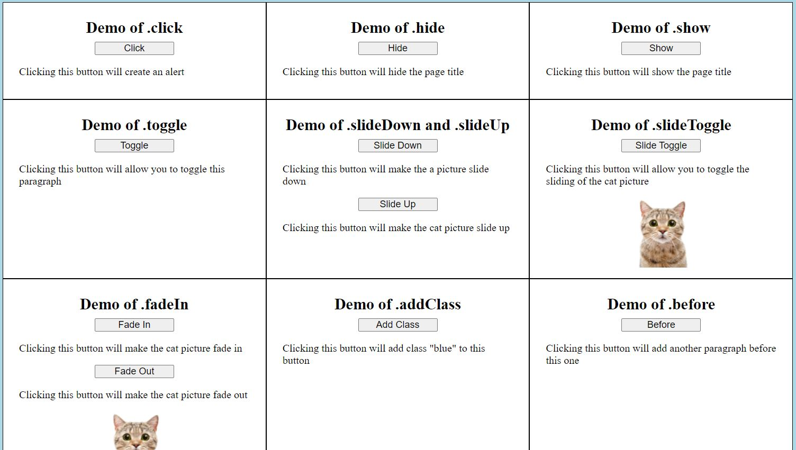

<h1>Demonstration of various jQuery functions.</h1> 
<h2>Click buttons to produce different webpage effects.</h2>

17 jQuery functions demonstrated: .click, .hide, .show, .toggle, .ready, .slideDown, .slideUp, .slideToggle, .fadeIn, .fadeOut, .addClass, .before, .append, .html, .attr, .val, .text

